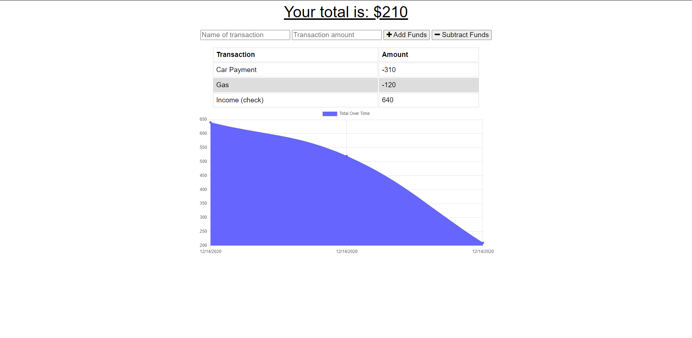
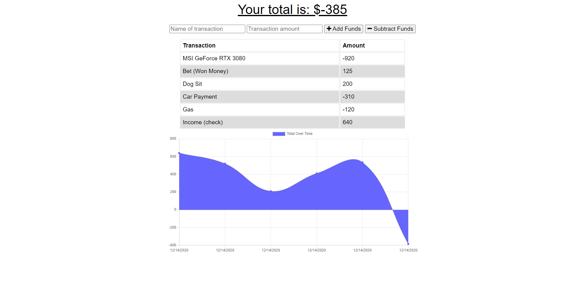
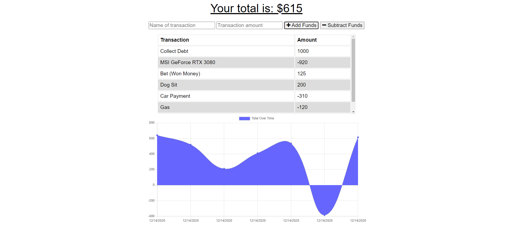

# AllLine Budget Tracker
ALWAYS ALL LINE!
## Table of Contents
1. [ Description ](#desc)
2. [ Installation ](#install)
3. [ License ](#lic)
4. [ Questions ](#quest)
    

## 1. Description
Budget Tracker Aplication to allow for offline access and functionality.

User will be able to add expenses and deposits to their budget with or without a connection. When entering transactions offline, they should populate the total when brought back online.

Offline Functionality:

  * Enter deposits offline

  * Enter expenses offline

When brought back online:

  * Offline entries should be added to tracker.
    

## 2. Installation
npm install, npm start, node server.js
    
    

## 3. License
MIT
    
    

## 4. Questions
Please visit my GitHub to view all of my work:

https://www.github.com/CdmMandolorian 

Contact me at: egalindounited@gmail.com

## LIVE LINK: 
<a href="https://all-line-budget-tracker.herokuapp.com/">AllLine Budget Tracker</a>

## Screenshots of AllLine Budget Tracker:

## Repository:  
[AllLine Budget Tracker](https://github.com/CdmMandalorian/)  

  
## Portfolio:  
[Armando Galindo Portfolio](https://cdmmandalorian.github.io/Armando-E-Galindo-Portfolio/)

## Credits:    
HTML 5  
CSS    
BootStrap                      
Javascript                   
Node      
Webpack PWA        
Mongoose DB / Atlas           
Mongoose Schema          
Heroku      